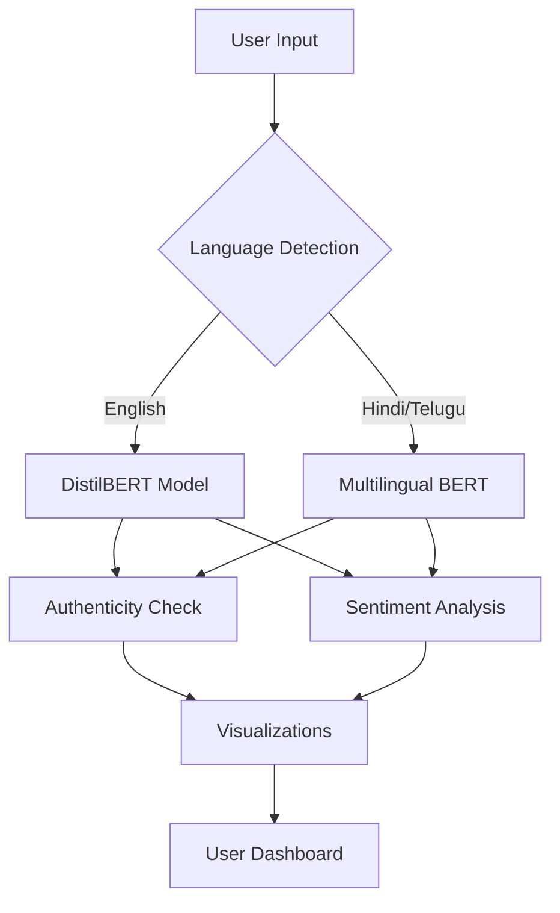

# **Feedback Authenticity Analyzer - General Documentation**  

## **1. Introduction**  
The **Feedback Authenticity Analyzer** is an AI-powered web application that helps businesses and individuals detect **fake reviews** and analyze **customer sentiment** in multiple languages (English, Hindi, Telugu).  

### **Key Objectives**  
✔ **Detect Fake Reviews** – Uses NLP models to classify feedback as **Genuine** or **Fake**.  
✔ **Sentiment Analysis** – Determines if feedback is **Positive, Negative, or Neutral**.  
✔ **Multilingual Support** – Works with **English, Hindi, and Telugu** text.  
✔ **Data Visualization** – Provides charts, word clouds, and confidence metrics.  

---

## **2. Features**  

### **2.1. Core Features**  
| Feature | Description |  
|---------|------------|  
| **Single Feedback Analysis** | Analyze one review at a time with language detection. |  
| **Batch Processing** | Upload CSV/Excel files to analyze multiple reviews. |  
| **Sentiment Detection** | Classifies feedback as Positive, Negative, or Neutral. |  
| **Fake Review Detection** | Flags suspicious reviews with confidence scores. |  
| **Interactive Dashboard** | Displays analytics, charts, and word clouds. |  

### **2.2. Supported Languages**  
✅ **English** (High Accuracy)  
✅ **Hindi** (Moderate Accuracy)  
✅ **Telugu** (Moderate Accuracy)  

---

## **3. How It Works**  

### **3.1. User Flow**  
1. **User Input** → Paste text or upload a file.  
2. **Language Detection** → Auto-detects or manual selection.  
3. **AI Analysis** →  
   - Checks if review is **Genuine/Fake** (BERT models).  
   - Computes **Sentiment & Polarity** (TextBlob/BERT).  
4. **Results Display** → Dashboard with insights & visualizations.  

### **3.2. Technical Workflow**  


---

## **4. System Requirements**  

### **4.1. For Deployment**  
- **Python 3.8+**  
- **Libraries**:  
  - `streamlit` (Web UI)  
  - `transformers` (BERT models)  
  - `torch` (PyTorch for NLP)  
  - `pandas` (Data processing)  
  - `nltk` (Text processing)  
  - `matplotlib/seaborn` (Visualizations)  

### **4.2. Hardware Recommendations**  
- **CPU**: Minimum 4 cores  
- **RAM**: 8GB+ (for BERT models)  
- **GPU** (Optional): For faster inference (CUDA-supported)  

---

## **5. Installation & Setup**  

### **5.1. Local Deployment**  
1. **Clone the repository** (if available).  
2. Install dependencies:  
   ```bash
   pip install streamlit transformers torch pandas nltk textblob wordcloud matplotlib seaborn langdetect
   ```  
3. Run the app:  
   ```bash
   streamlit run app.py
   ```  

### **5.2. Cloud Deployment**  
- Can be hosted on **Streamlit Cloud, AWS, or GCP**.  
- Requires `requirements.txt` for dependency management.  

---

## **6. Usage Guide**  

### **6.1. Input Methods**  
- **Manual Input**: Type/paste feedback in the text box.  
- **File Upload**: Upload a CSV/Excel file with a `feedback` column.  

### **6.2. Output Interpretation**  
| Output | Meaning |  
|--------|---------|  
| **GENUINE** | Likely written by a real user. |  
| **FAKE** | Suspicious patterns detected. |  
| **POSITIVE** | Favorable sentiment. |  
| **NEGATIVE** | Unfavorable sentiment. |  
| **Confidence Score** | Model’s certainty (0-100%). |  

### **6.3. Dashboard Features**  
📊 **Charts**: Authenticity, sentiment, and language distribution.  
☁ **Word Clouds**: Frequent keywords in genuine vs. fake reviews.  
📥 **Export**: Download results as CSV.  

---

## **7. Limitations**  
⚠ **Hindi/Telugu accuracy** is lower than English.  
⚠ **No real-time API** (only batch processing).  
⚠ **No user accounts** (data resets on page refresh).  

---

## **8. Future Enhancements**  
🔹 **Add more languages** (Tamil, Bengali).  
🔹 **Integrate with e-commerce APIs** (Amazon, Flipkart).  
🔹 **Improve fake review detection** using ensemble models.  

---

## **9. Conclusion**  
This tool helps businesses **identify fake reviews** and **analyze customer sentiment** efficiently. It is useful for:  
- **E-commerce platforms** (detect fraudulent reviews).  
- **Customer support teams** (prioritize negative feedback).  
- **Market researchers** (track sentiment trends).  

🚀 **Deployable on cloud platforms** for scalability.  

